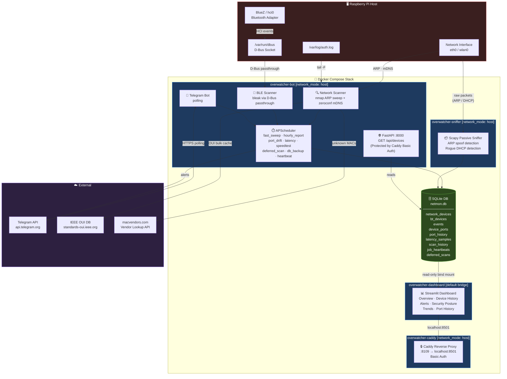

# OverwatcherPI

> A fully async, modular, open-source network surveillance daemon for Raspberry Pi — streams real-time telemetry to a secure Telegram Bot, runs a web dashboard, and now ships as a full Docker Compose stack.

---

## Architecture & Data Flow



---

## Features

### 🔍 Network Intelligence
- **Fast ARP Sweeps** — `nmap`-based host discovery every 5 min, enhanced with `zeroconf` mDNS
- **Intelligent Nmap Scheduler** — defers heavy `-sV` port scans during high network jitter; runs them during quiet hours (1–5 AM by default)
- **Differential Tracking** — diffs topology against baseline, flags new/disappeared devices instantly
- **Port Drift Detection** — daily `-sV` scans on known devices; alerts on newly opened ports with full historical time-series in the dashboard
- **Device Identification** — offline IEEE OUI bulk cache + live `macvendors.com` fallback (OUI prefix only, never full MAC)

### 📡 Bluetooth / BLE
- **BLE Discovery** — async scanning via `bleak` / BlueZ
- **Payload Fingerprinting** — SHA-256 fingerprint of service UUIDs + manufacturer data + bucketed TX power; suppresses duplicate alerts for 24h
- **Proximity Zones** — classifies devices as Immediate / Near / Far based on RSSI

### 🛡️ Security Monitoring
- **ARP Spoof Detection** — passive Scapy sniffer watching for conflicting MAC↔IP bindings
- **Rogue DHCP Detection** — flags unexpected DHCP servers; validates `subnet_mask` and `router` fields against trusted config
- **SSH Brute-Force Monitoring** — tails `/var/log/auth.log` for repeated failures and successful logins from unknown IPs
- **Honeypot Canary** — listens on fake ports (e.g. 2323, 8389) and alerts instantly if any device attempts a TCP connection
- **Passive DNS Logging** — extracts port 53 DNS queries via the sniffer daemon, alerts on known-bad domains (StevenBlack hosts), and surfaces recent lookups in the dashboard

### 📊 Observability
- **Latency & Jitter Monitoring** — continuous ping to gateway + WAN; data stored for trend graphs
- **Speedtest** — periodic internet bandwidth measurement (configurable interval)
- **System Health** — CPU, RAM, disk, SoC temperature, under-voltage / throttling detection
- **Service Watchdog** — monitors sibling Docker/systemd services; alerts if one goes down
- **Resource Alerts** — configurable CPU/RAM/disk thresholds with cooldown periods
- **Job Heartbeats** — every scheduled job records its last run time; used as Docker healthcheck source

### 🛠️ Reliability & Maintainability
- **Automated DB Backups** — SQLite `.backup` API safely dumps the live database every night
- **Config Drift Detection** — Hashes your active configuration and alerts you if manual edits drift from the baseline
- **Dead-Man's Switch** — Telegram heartbeat tracking and fallback file logging ensures you never fail silently
- **Command Abuse Guard** — In-memory rate limits protect the hardware scanners from API or bot flood attacks
- **Automated Testing** — Fully tested via `pytest` to validate database interactions and rate-limiting

### 🌐 Interfaces
- **Telegram Bot** — real-time alerts + on-demand commands
- **Streamlit Dashboard** — LAN-accessible; device history, security posture, trends, port history, event log
- **FastAPI REST endpoint** — `GET /api/devices` for programmatic access
- **Caddy Reverse Proxy** — HTTPS-grade Basic Auth protects both the Dashboard and the `/api/*` endpoints; never exposes internal ports directly

---

## Telegram Commands

| Command | Description |
|---------|-------------|
| `/status` | Raspberry Pi system health, temperature & throttling |
| `/network` | Trigger immediate subnet ARP sweep |
| `/bluetooth` | Trigger 10-second BLE discovery |
| `/speedtest` | Run internet speed test |
| `/traceroute <host>` | On-demand traceroute |
| `/attacker <ip>` | WHOIS / OSINT lookup on an IP |
| `/whitelist <mac>` | Mark a device as known/safe |
| `/monitor <ip>` | Add host to 1-minute uptime ping monitor |
| `/unmonitor <ip>` | Remove host from ping monitor |
| `/dns <ip>` | View recent DNS queries for host |

---

## Deployment

### 🐳 Docker (Recommended)

**Pre-flight:**
```bash
# 1. Configure .env
cp .env.example .env
nano .env   # set TELEGRAM_BOT_TOKEN, TELEGRAM_OWNER_IDS, SNIFFER_INTERFACE, API_TOKEN

# 2. Generate Caddy password hash
docker run --rm caddy:2-alpine caddy hash-password
# Paste the output into dashboard/Caddyfile
```

**Start:**
```bash
docker compose build
docker compose up -d
docker compose logs -f   # watch startup
```

All 4 services will come up:

| Service | Network | Port |
|---------|---------|------|
| `overwatcher-bot` | `host` | — |
| `overwatcher-sniffer` | `host` | — |
| `overwatcher-dashboard` | default bridge | `127.0.0.1:8501` (local only) |
| `overwatcher-caddy` | `host` | **8109** (public) |

Dashboard: `http://<pi-ip>:8109/`

See [`docs/docker.md`](docs/docker.md) for the full migration guide, healthcheck details, and rollback instructions.

---

### 🔧 Manual / systemd (Legacy)

<details>
<summary>Expand legacy installation steps</summary>

1. **Clone & venv:**
   ```bash
   git clone https://github.com/AbhiPra24/OverwatcherPI.git && cd OverwatcherPI
   python3 -m venv venv && source venv/bin/activate
   pip install -r requirements.txt
   ```

2. **Permissions:**
   ```bash
   sudo usermod -aG bluetooth $USER
   sudo setcap cap_net_raw,cap_net_admin,cap_net_bind_service+eip $(which nmap)
   ```

3. **Configure:**
   ```bash
   cp .env.example .env && nano .env
   ```

4. **Dashboard venv:**
   ```bash
   python3 -m venv dashboard/venv
   source dashboard/venv/bin/activate
   pip install -r dashboard/requirements-dashboard.txt
   ```

5. **Enable services:**
   ```bash
   sudo cp overwatcher.service /etc/systemd/system/
   sudo cp overwatcher-sniffer.service /etc/systemd/system/
   sudo cp overwatcher-dashboard.service /etc/systemd/system/
   sudo cp overwatcher-caddy.service /etc/systemd/system/
   sudo systemctl daemon-reload
   sudo systemctl enable --now overwatcher overwatcher-sniffer overwatcher-dashboard overwatcher-caddy
   ```

</details>

---

## Configuration (`.env`)

| Variable | Default | Description |
|----------|---------|-------------|
| `TELEGRAM_BOT_TOKEN` | *(required)* | Bot token from @BotFather |
| `TELEGRAM_OWNER_IDS` | *(required)* | Comma-separated Telegram user IDs |
| `SCAN_SUBNET` | `192.168.1.0/24` | Subnet to sweep |
| `GATEWAY_IP` | `192.168.1.1` | Gateway for latency monitoring |
| `SNIFFER_INTERFACE` | *(required for sniffer)* | e.g. `eth0` |
| `TRUSTED_DHCP_SERVER` | *(empty)* | Expected DHCP server IP |
| `SWEEP_INTERVAL_MINUTES` | `5` | Fast sweep frequency |
| `QUIET_HOURS_START` | `1` | Hour to begin deferred scan window |
| `QUIET_HOURS_END` | `5` | Hour to end deferred scan window |
| `NETWORK_JITTER_THRESHOLD_MS` | `50.0` | Jitter above which full nmap is deferred |
| `API_TOKEN` | *(set this!)* | Bearer token for `/api/devices` |
| `API_PORT` | `8000` | FastAPI port |
| `LOG_FORMAT` | `text` | `text` or `json` (for jq-able logs) |
| `WATCHED_SERVICES` | `["overwatcher-dashboard","overwatcher-caddy","overwatcher-sniffer"]` | Services to health-monitor |
| `HONEYPOT_ENABLED` | `false` | Enable canary honeypot listener |
| `DNS_RETENTION_DAYS`   | `14`   | Days to retain DNS logs |
| `THREAT_INTEL_ENABLED` | `false`| Alert on malware/ads domain and IP queries |
| `CPU_WARN_PERCENT` | `85.0` | CPU alert threshold |
| `RAM_WARN_PERCENT` | `85.0` | RAM alert threshold |
| `DISK_WARN_PERCENT` | `90.0` | Disk alert threshold |
| `MACVENDORS_API_ENABLED` | `true` | Disable to prevent OUI prefix sends |

---

## Known Limitations

- **BLE Privacy:** iOS/Android rotate BLE MAC addresses every ~15 min. Payload fingerprinting mitigates this for alert deduplication, but long-term device identity tracking is not possible by design.
- **Passive Sniffer on WiFi:** On switched networks, the sniffer only sees broadcast ARP/DHCP. On some Pi WiFi chipsets, continuous promiscuous-mode sniffing can affect stability — use a wired `SNIFFER_INTERFACE` where possible.
- **OUI Lookup Privacy:** The `macvendors.com` fallback sends only the 3-byte OUI prefix (never the full MAC). Set `MACVENDORS_API_ENABLED=false` to disable entirely.
- **BLE under Docker:** D-Bus passthrough (`/var/run/dbus:/var/run/dbus`) is functional but sensitive to BlueZ/Docker version combinations. If BLE stops working post-migration, see the fallback option in [`docs/docker.md`](docs/docker.md).
